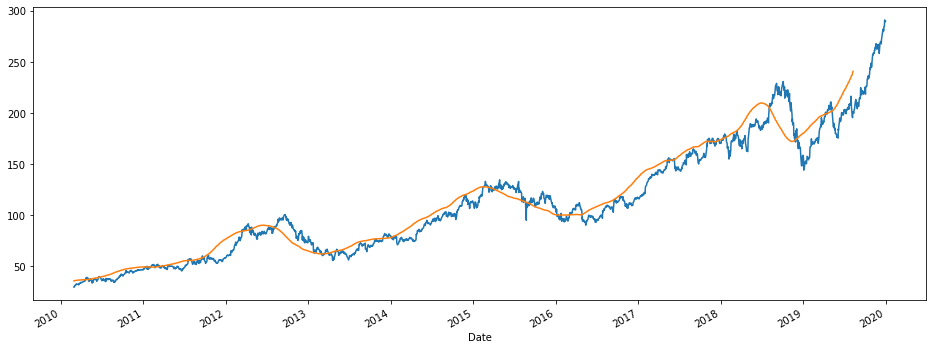
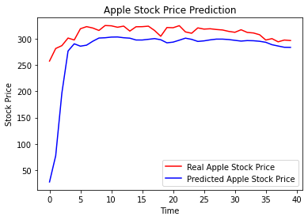

# Apple Stock Prediction

Apple stock prediction written in Python using Keras API and Tensorflow backend.

## Data Preparation

```python
# Import libraries

import matplotlib.pyplot as plt
import datetime

# Import dataset

df = pd.read_csv(r'/kaggle/input/apple-aapl-historical-stock-data/HistoricalQuotes.csv', index_col='Date', parse_dates=True)
```


```python
# Test if missing values exist

df.isna().any()
```


     Close/Last    False
     Volume        False
     Open          False
     High          False
     Low           False
    dtype: bool


```python
df.info()
```

    <class 'pandas.core.frame.DataFrame'>
    DatetimeIndex: 2518 entries, 2020-02-28 to 2010-03-01
    Data columns (total 5 columns):
     #   Column       Non-Null Count  Dtype 
    ---  ------       --------------  ----- 
     0    Close/Last  2518 non-null   object
     1    Volume      2518 non-null   int64 
     2    Open        2518 non-null   object
     3    High        2518 non-null   object
     4    Low         2518 non-null   object
    dtypes: int64(1), object(4)
    memory usage: 118.0+ KB

Column's types aren't exploitable as is. We need to convert them to floats.

```python
# Cleaning data

df = df.rename(columns={' Close/Last':'Close', ' Volume':'Volume', ' Open': 'Open', ' High':'High', ' Low':'Low'})
df['Close'] = df['Close'].str.replace('$', '').astype('float')
df['Open'] = df['Open'].str.replace('$', '').astype('float')
df['High'] = df['High'].str.replace('$', '').astype('float')
df['Low'] = df['Low'].str.replace('$', '').astype('float')
df.head()
```

| Date           | Close  | Volume    | Open   | High   | Low    |
| -------------- | ------ | --------- | ------ | ------ | ------ |
| **2020-02-28** | 273.36 | 106721200 | 257.26 | 278.41 | 256.37 |
| **2020-02-27** | 273.52 | 80151380  | 281.10 | 286.00 | 272.96 |
| **2020-02-26** | 292.65 | 49678430  | 286.53 | 297.88 | 286.50 |
| **2020-02-25** | 288.08 | 57668360  | 300.95 | 302.53 | 286.13 |
| **2020-02-24** | 298.18 | 55548830  | 297.26 | 304.18 | 289.23 |


```python
df.dtypes
```


    Close     float64
    Volume      int64
    Open      float64
    High      float64
    Low       float64
    dtype: object

## Model Building

We now create our training and testing sub-datasets.


```python
# Split training and testing datasets

df_test = df.head(40)
df = df[40:]
```


```python
# Moving average

df['Open'].plot(figsize=(16, 6))
df.rolling(100).mean()['Open'].plot()
```




Fitting will be applied on the "Open" feature.

```python
training_df = df['Open']
training_df = pd.DataFrame(training_df)
```


```python
# Feature scaling

from sklearn.preprocessing import MinMaxScaler
sc = MinMaxScaler(feature_range = (0,1))
training_df_scaled = sc.fit_transform(training_df)
```


```python
# Create structure with 60 timesteps and 1 output

X_train = []
y_train = []
for i in range(60, 2477):
    X_train.append(training_df_scaled[i-60:i, 0])
    y_train.append(training_df_scaled[i, 0])
X_train, y_train = np.array(X_train), np.array(y_train)


# Reshape

X_train = np.reshape(X_train, (X_train.shape[0], X_train.shape[1], 1))
```


```python
# Import Keras

from keras.models import Sequential
from keras.layers import Dense
from keras.layers import LSTM
from keras.layers import Dropout
```


```python
# Initialize RNN

regressor = Sequential()
```

Our neural network will be include 4 LSTM layers chosen for their ability to "forget". We want to get rid of unsignificant data.


```python
# First LSTM layer

regressor.add(LSTM(units = 50, return_sequences = True, input_shape = (X_train.shape[1], 1)))
regressor.add(Dropout(0.2))


# Second LSTM layer

regressor.add(LSTM(units = 50, return_sequences = True))
regressor.add(Dropout(0.2))


# Thirs LSTM layer

regressor.add(LSTM(units = 50, return_sequences = True))
regressor.add(Dropout(0.2))


# Fourth LSTM layer

regressor.add(LSTM(units = 50))
regressor.add(Dropout(0.2))

              
# Output layer

regressor.add(Dense(units = 1))
```


```python
# Compile RNN

regressor.compile(optimizer = 'adam', loss = 'mean_squared_error')


# Fit RNN

regressor.fit(X_train, y_train, epochs = 100, batch_size = 32)
```


```python
real_stock_price = df_test['Open'].values
```


```python
df_test.info()
```

    <class 'pandas.core.frame.DataFrame'>
    DatetimeIndex: 40 entries, 2020-02-28 to 2020-01-02
    Data columns (total 5 columns):
     #   Column  Non-Null Count  Dtype  
    ---  ------  --------------  -----  
     0   Close   40 non-null     float64
     1   Volume  40 non-null     int64  
     2   Open    40 non-null     float64
     3   High    40 non-null     float64
     4   Low     40 non-null     float64
    dtypes: float64(4), int64(1)
    memory usage: 1.9 KB

```python
test_set = df_test['Open']
test_set = pd.DataFrame(test_set)
```

```python
df_total = pd.concat((df['Open'], df_test['Open']), axis = 0)
inputs = df_total[len(df_total) - len(df_test) - 60:].values
inputs = inputs.reshape(-1,1)
inputs = sc.transform(inputs)
X_test = []
for i in range(60, 100):
    X_test.append(inputs[i-60:i, 0])
X_test = np.array(X_test)
X_test = np.reshape(X_test, (X_test.shape[0], X_test.shape[1], 1))

predicted_stock_price = regressor.predict(X_test)
predicted_stock_price = sc.inverse_transform(predicted_stock_price)
```


```python
predicted_stock_price = pd.DataFrame(predicted_stock_price)
predicted_stock_price = predicted_stock_price.values
```

## Results


```python
# Plot the results

plt.plot(real_stock_price, color = 'red', label = 'Real Apple Stock Price')
plt.plot(predicted_stock_price, color = 'blue', label = 'Predicted Apple Stock Price')
plt.title('Apple Stock Price Prediction')
plt.xlabel('Time')
plt.ylabel('Stock Price')
plt.legend()
plt.show()
```




